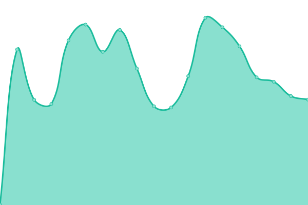

# [📈 Live Status](https://status1.netsoc.co): <!--live status--> **🟧 Partial outage**

This repository contains the open-source uptime monitor and status page for [UCC Netsoc](http://netsoc.co/), powered by [Upptime](https://github.com/upptime/upptime).

With [Upptime](https://upptime.js.org), you can get your own unlimited and free uptime monitor and status page, powered entirely by a GitHub repository. We use [Issues](https://github.com/uccnetsoc/upptime/issues) as incident reports, [Actions](https://github.com/uccnetsoc/upptime/actions) as uptime monitors, and [Pages](https://status1.netsoc.co) for the status page.

<!--start: status pages-->
<!-- This summary is generated by Upptime (https://github.com/upptime/upptime) -->
<!-- Do not edit this manually, your changes will be overwritten -->
<!-- prettier-ignore -->
| URL | Status | History | Response Time | Uptime |
| --- | ------ | ------- | ------------- | ------ |
|  [netsoc.co](https://netsoc.co) | 🟩 Up | [netsoc-co.yml](https://github.com/UCCNetsoc/upptime/commits/HEAD/history/netsoc-co.yml) | 

 606ms
     
 | 

<a href="https://status.netsoc.co/history/netsoc-co">100.00%</a>
    

|  [netsoc.cloud](https://netsoc.cloud) | 🟩 Up | [netsoc-cloud.yml](https://github.com/UCCNetsoc/upptime/commits/HEAD/history/netsoc-cloud.yml) | 

 361ms
     
 | 

<a href="https://status.netsoc.co/history/netsoc-cloud">100.00%</a>
    

|  [wiki.netsoc.co](https://wiki.netsoc.co) | 🟥 Down | [wiki-netsoc-co.yml](https://github.com/UCCNetsoc/upptime/commits/HEAD/history/wiki-netsoc-co.yml) | 

 0ms
     
 | 

<a href="https://status.netsoc.co/history/wiki-netsoc-co">0.00%</a>
    

|  [blog.netsoc.co](https://blog.netsoc.co) | 🟩 Up | [blog-netsoc-co.yml](https://github.com/UCCNetsoc/upptime/commits/HEAD/history/blog-netsoc-co.yml) | 

 421ms
     
 | 

<a href="https://status.netsoc.co/history/blog-netsoc-co">100.00%</a>
    

|  [Netsoc Cloud API](https://api.netsoc.cloud/docs) | 🟩 Up | [netsoc-cloud-api.yml](https://github.com/UCCNetsoc/upptime/commits/HEAD/history/netsoc-cloud-api.yml) | 

 382ms
     
 | 

<a href="https://status.netsoc.co/history/netsoc-cloud-api">100.00%</a>
    

|  [Netsoc Cloud UI](https://netsoc.cloud) | 🟩 Up | [netsoc-cloud-ui.yml](https://github.com/UCCNetsoc/upptime/commits/HEAD/history/netsoc-cloud-ui.yml) | 

 93ms
     
 | 

<a href="https://status.netsoc.co/history/netsoc-cloud-ui">100.00%</a>
    

|  [Netsoc Cloud Authentication Services](https://keycloak.netsoc.co) | 🟩 Up | [netsoc-cloud-authentication-services.yml](https://github.com/UCCNetsoc/upptime/commits/HEAD/history/netsoc-cloud-authentication-services.yml) | 

 337ms
     
 | 

<a href="https://status.netsoc.co/history/netsoc-cloud-authentication-services">100.00%</a>
    

|  [Netsoc Cloud LXC Services](https://whoami-lxc-thomas-container.netsoc.cloud) | 🟥 Down | [netsoc-cloud-lxc-services.yml](https://github.com/UCCNetsoc/upptime/commits/HEAD/history/netsoc-cloud-lxc-services.yml) | 

 3131ms
     
 | 

<a href="https://status.netsoc.co/history/netsoc-cloud-lxc-services">0.00%</a>
    

|  [Netsoc Cloud VPS Services](https://whoami-vps-thomas-vps.netsoc.cloud) | 🟩 Up | [netsoc-cloud-vps-services.yml](https://github.com/UCCNetsoc/upptime/commits/HEAD/history/netsoc-cloud-vps-services.yml) | 

 377ms
     
 | 

<a href="https://status.netsoc.co/history/netsoc-cloud-vps-services">100.00%</a>
    

<!--end: status pages-->

[**Visit our status website →**](https://status1.netsoc.co)

## 📄 License

- Powered by: [Upptime](https://github.com/upptime/upptime)
- Code: [MIT](./LICENSE) © [UCC Netsoc](http://netsoc.co/)
- Data in the `./history` directory: [Open Database License](https://opendatacommons.org/licenses/odbl/1-0/)
